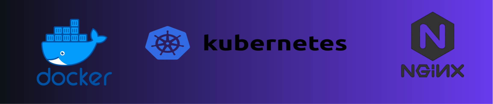
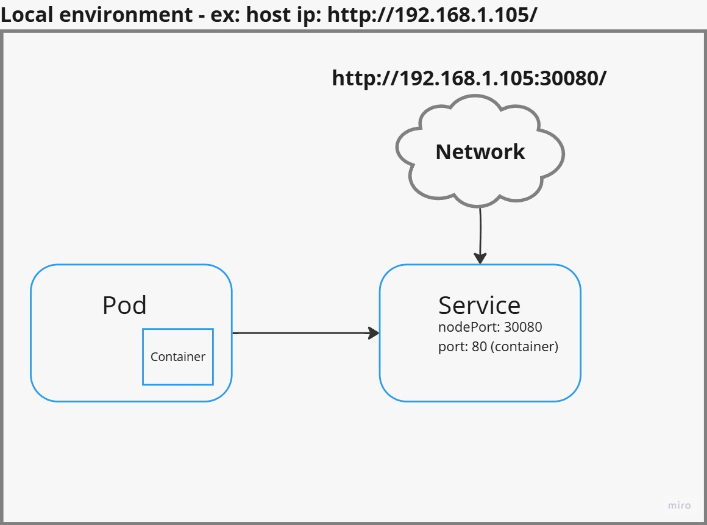
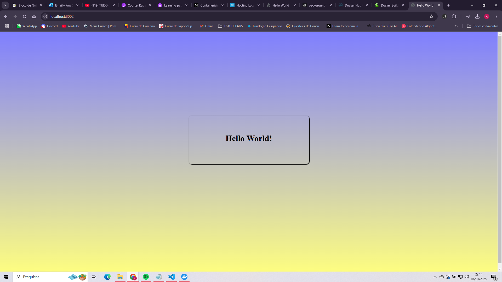
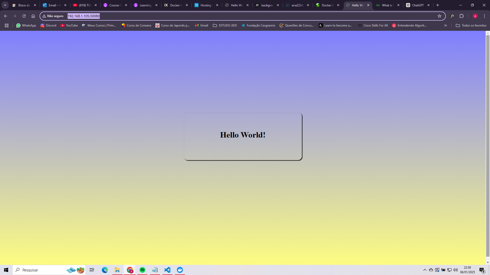

# Creating a hello world application.

<p align="center">
  
</p>

[](https://www.docker.com/)
[](https://nginx.org/)
[](https://kubernetes.io/)



Requirements:

- Docker desktop installed.
  Run : `docker --version`
- Kubernetes activated.
  Run : `kubectl get all`

## Table of Contents

1. [Folder structure](#folder-structure)
2. [Creating the image](#creating-the-image)
3. [Testing the image](#testing-the-image)
4. [Creating the application hello world](#creating-the-application-hello-world)

---

## Folder structure

```
helloWorld/
├── scripts/
├────── helloworld.yaml
├────── service.yaml
```

- helloworld.yaml: To create the pod
- service.yaml: To create the service.

You can find these files in the `/scripts` folder in the current repository.

## Creating the image

The following content will create the image for our container. **You don´t need to create a new one, so don´t follow this step**

```Dockerfile
FROM nginx:alpine
COPY ./usr/share/nginx/html
```

This Dockerfile is going to create a image, that image is going to be used to create a container inside a Pod.

```sh
#Creating a image called hello, the Dockerfile needs to be in the current folder.
> docker build -t hello .
#Check the new image and copy it´s id.
> docker images
> docker tag 0561e9c08023 ana2234/hello:latest
> docker images
> docker push ana2234/hello:latest
```

## Testing the image

Run this in your terminal.

```sh
> docker run -d -p 8002:80 ana2234/hello
```

Browser: http://localhost:8002/



## Creating the application hello world

Create the following files in your folder:

helloworld.yaml

```yaml
apiVersion: v1
kind: Pod
metadata:
  name: helloworld-pod
  labels:
    app: helloapp
spec:
  containers:
    - name: helloworld
      image: ana2234/hello:latest
```

services.yaml

```yaml
apiVersion: v1
kind: Service
metadata:
  name: helloworld-service
spec:
  selector:
    app: helloapp
  ports:
    - name: http
      port: 80
      nodePort: 30080
  type: NodePort
```

Open the terminal in your folder:

```sh
> kubectl get all
> kubectl apply -f .\services.yaml
> kubectl apply -f .\helloworld.yaml
> kubectl get all
> ipconfig
```

Browser: `<seu_ip>:30080`


